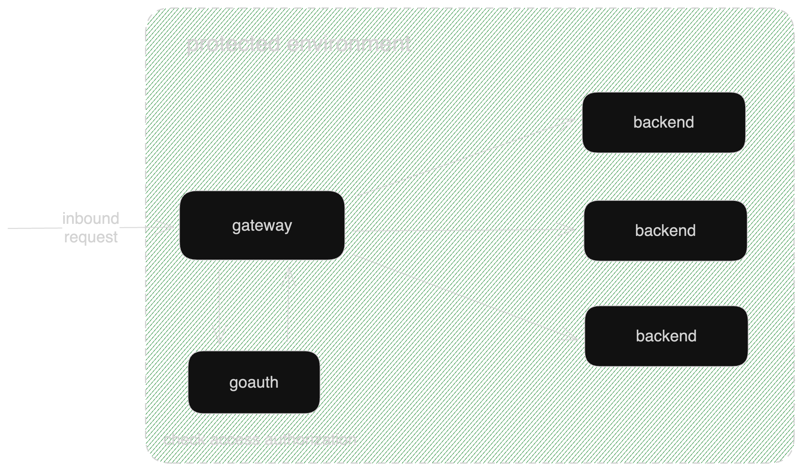

# goauth

Role, resource and endpoint management service implemented in go. All my go projects integrate with goauth using [github.com/curtisnewbie/gocommon](https://github.com/curtisnewbie/gocommon).

## Main Concepts

A role is merely a role name with a bunch resources bound to it. A Resource indicates that someone has the permission to access certain endpoints. These endpoints are uniquely identified by a HTTP method and a request URL. goauth is responsible for managing these three concepts. Administrators of a system can create a new role or change the resources that are bound to a role, but the resources and the endpoints are reported by the protected backend services.

Services can report their resources and endpoints to goauth synchronously using goauth's http endpoints or asynchronously using goauth's rabbitmq exchanges. However, since v1.0.20, goauth now prefer to collect resources and endpoints information from backend services using a poll-based mechanism. Beckend services are expected to declare a REST endpoint `GET /auth/resource` to expose their paths and resources information. If configured (in goauth), goauth will continually monitor these services by sending HTTP requests to these endpoints in every minute or when the service instance changes (noticed by consul).

</img>

goauth is designed to work with a gateway service (e.g., [gatekeeper](https://github.com/curtisnewbie/gatekeeper)) as follows:

</img>

